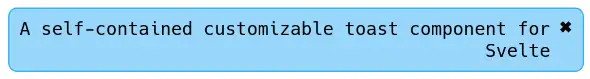

# svelte-toast

## Preview
To run the demo website simply clone the repository, run `pnpm i` and then start the server with `pnpm dev`

## Installation
No npm package required, simply:
- Copy the `src/lib/ToastDrawer.svelte` file to your proyect.
- Add the `ToastDrawer` component in your layout and customize its position.
- Use the exported `createToast` to create a toast from anywhere in your app.

> This way you don't need another dependency bloating your proyect and you can customize the component however you want.
